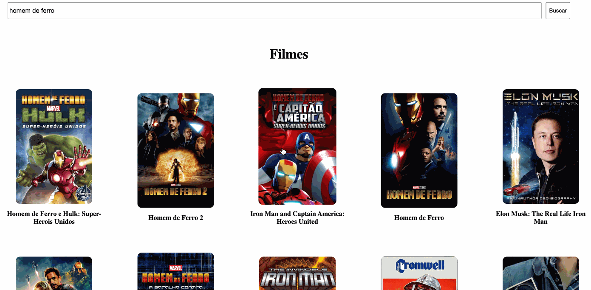

<h1> Buscador-de-filmes </h1>

Esse é um projeto desenvolvido por mim para o Bootcamp Spread Fullstack Web Developer, onde o desafio era criar uma aplicação utilizando ReactJS focando em um Front-End Componentizado.

Digitando o nome do filme na barra de busca e clicando em buscar, você terá algumas opções de filmes para escolher. 
Ao clicar em algum dos filmes, os detalhes do mesmo será apresentado na tela.

<h3>Tecnologias Utilizadas:</h3>
<ul>
    <li>Javascript</li>
    <li>HTML</li>
    <li>CSS</li>
    <li>ReactJS</li>
</ul>

<h3>Prévia:</h3>
<h1 align="center">
    
</h1>
